<div align="center">
  <picture>
    <source media="(prefers-color-scheme: dark)" srcset="./dark.svg">
    <source media="(prefers-color-scheme: light)" srcset="./light.svg">
    
  </picture>
</div>

<br />

## 👨‍💻 About Me

I am a Software Engineer and Full Stack Developer focused on building robust, scalable applications and seamless user experiences. 

* 🔭 **Currently working on:** Enterprise software and full-stack web applications.
* 🌱 **Currently learning:** Advanced AI integrations and scalable cloud architectures.
* 💬 **Ask me about:** React, Next.js, Node.js, and database management.
* 📫 **How to reach me:** [abhinandsd49@gmail.com](mailto:abhinandsd49@gmail.com)

<br />

## 🛠️ Languages and Tools

<div align="left">
  
  
  
  
  
  
  
  
  
  
  
  
  
  
  
  
  
  
  
</div>

<br />

## Contribution Activity

<div align="center">


</div>

<div align="center">


</div>

---

## Current Focus

```yaml
Learning:
  - System Design & Distributed Systems
  - Advanced Backend Architecture
  - Cloud Engineering on AWS

Building:
  - AI-powered production applications
  - SaaS platforms with enterprise-grade architecture
  - Developer tooling and branding products

Exploring:
  - Large Language Models & retrieval-augmented generation
  - Scalable event-driven systems
  - AWS ecosystem (ECS, Lambda, RDS, Bedrock)

Open To:
  - Software Engineering roles at product-first companies
  - AI / ML Engineer opportunities
  - Open source collaborations
```

---

## Connect

<div align="center">

<a href="mailto:sushmitadasari17@gmail.com">
  
</a>
&nbsp;
<a href="https://www.linkedin.com/in/abhinand-sd/" target="_blank">
  
</a>
&nbsp;
<a href="https://github.com/Abhinand-sd" target="_blank">
  
</a>
&nbsp;
<a href="https://abhinandsdin.vercel.app/" target="_blank">
  
</a>

</div>

<br/>

<div align="center">

*Building at the intersection of AI, full-stack engineering, and systems thinking.*


</div>
